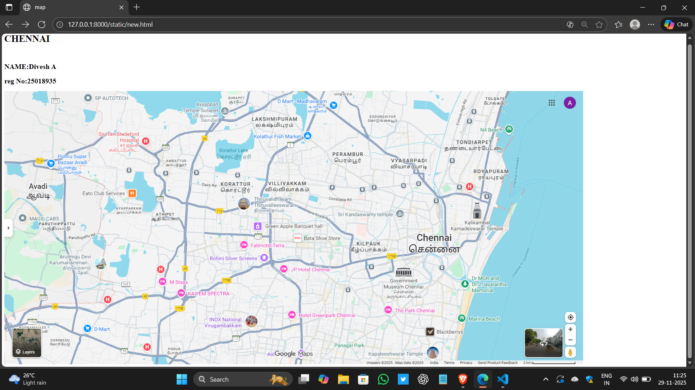

# Ex03 Places Around Me
## Date: 

## AIM
To develop a website to display details about the places around my house.

## DESIGN STEPS

### STEP 1
Create a Django admin interface.

### STEP 2
Download your city map from Google as an image.

### STEP 3
Insert the image using `````` tag and link it to the map.

### STEP 4
Using ```<map>``` tag name the map.

### STEP 5
Create clickable regions in the image using ```<area>``` tag.

### STEP 6
Write HTML programs for all the regions identified.

### STEP 7
Execute the programs and publish them.

## CODE
```
new.html

<html>
    <head>
        <title>map</title>

    </head>

    <body>
        <h1 align="center">CHENNAI</h1>
        <br>
        <h2 align="center">NAME:Divesh A</h2>
        <h2 align="center">reg No:25018935</h2>
        

<map name="image-map">
    <area target="" alt="Eato Club Services" title="Eato Club Services" href="EatoClubServices.html " coords="247,317,444,365" shape="rect">
    <area target="" alt="Ponnu Super Bazaar Avadi" title="Ponnu Super Bazaar Avadi" href="Ponnusuperbazaar.html" coords="152,198,218,159,290,198,283,288,166,291" shape="poly">
    <area target="" alt="hotelgreenpark" title="hotelgreenpark" href="hotelgreenpark.html" coords="1069,743,99" shape="circle">
    <area target="" alt="PERAMBUR" title="PERAMBUR" href="PERAMBUR.html" coords="1067,191,1077,267,1211,255,1191,181,1130,147" shape="poly">
   <area target="" alt="Rohini Silver screens" title="Rohini Silver screens" href="theater.html" coords="662,534,654,575,881,587,871,526,798,533,744,522" shape="poly">
</map>

    </body>
</html>

theater.html

<html>
<head>
    <title>theater</title>
</head>
<body bgcolor="pink">
    <h1 align="center">
        <font color="red"><b>CHENNAI</b></font>
    </h1>
    <h3 align="center">
        <font color="red"><B>ROHINI SILVER SCREENS</B></font>
        </h3>
        <hr size="4" color="black">
        <p align="justify">
            <font face="georgia" size="5">
             Rohini Silver Screens is a cinema located in Chennai, Tamil Nadu. It offers movie screenings in a theater setting, serving film enthusiasts in the Koyambedu area. While specific details about amenities or screen formats are not available, the venue is recognized as a local cinema destination. There is no information provided regarding customer ratings, reviews, or specific services such as online booking, food and beverage options, or accessibility features.  
            
        </p>
    </FONT>
    
</body>
</html>

PonnusuperBazaar.html

<html>
<head>
    <title>Bazaar</title>
</head>
<body bgcolor="SKYBLUE">
    <h1 align="center">
        <font color="WHITE"><b>CHENNAI</b></font>
    </h1>
    <h2 align="center">
        <font color="WHITE"><B>Ponnu super Bazaar</B></font>
        </h2>
        <hr size="4" color="black">
        <p align="justify">
            <font face="georgia" size="5" COLOR="BLACK">
            Ponnu Super Bazaar is a grocery store located in Avadi, Chennai, operating daily from 9:00 AM to 9:00 PM. It offers a range of grocery products and daily essentials, catering to local residents with a convenient shopping experience. The store is known for its organized layout and consistent availability of items. While specific ratings and reviews are not provided, its regular hours and dedicated space suggest reliable service. No significant pros or cons from customer feedback are available in the current information.
        </p>
    </FONT>
    
</body>
</html>

Hotelgreenpark.html

<html>
<head>
    <title>Hotel green park</title>
</head>
<body bgcolor="white">
    <h1 align="center">
        <font color="blue"><b>CHENNAI</b></font>
    </h1>
    <h2 align="center">
        <font color="blue"><B>Hotel green park</B></font>
        </h2>
        <hr size="4" color="black">
        <p align="justify">
            <font face="georgia" size="5" COLOR="BLACK">
                Hotel Greenpark in Chennai offers a charming and peaceful retreat with contemporary Indian design, ideal for both business and leisure travelers. Guests consistently praise the hotel's cleanliness, comfortable and spacious rooms, and serene ambiance enhanced by a nice pool area. The hotel is celebrated for its excellent dining experiences, featuring a variety of cuisines including Indian, Asian, barbecue, and international dishes, with standout mentions of the signature biryani and delicious starters. Multiple on-site restaurants like Roast & Grill provide an elegant and cozy atmosphere for meals. Service is a major highlight, with staff members such as Lavanya, Subho, Ramakrishnan, and Gowtham frequently commended for their friendliness, attentiveness, and personalized hospitality. The hotel has earned a high rating of 4.8 out of 5 based on over 4,200 reviews, reflecting widespread guest satisfaction. Pros include exceptional food, warm service, and a welcoming environment; there are no significant cons mentioned, though some note the gym is merely adequate.
                   </p>

    </FONT>
    
</body>
</html>

perambur.html

<html>
<head>
    <title>PERAMBUR</title>
</head>
<body bgcolor="VIOLET">
    <h1 align="center">
        <font color="RED"><b>CHENNAI</b></font>
    </h1>
    <h2 align="center">
        <font color="RED"><B>PERAMBUR</B></font>
        </h2>
        <hr size="4" color="RED">
        <p align="justify">
            <font face="georgia" size="5" COLOR="BLACK">
                Perambur is a well-established neighbourhood located in the northern region of Chennai, Tamil Nadu, India, with a pin code of 600011.
 The name "Perambur" originates from the Tamil words "pirambu" (bamboo) and "oor" (place), reflecting its historical identity as a bamboo forest before British rule, particularly around the Huzur Gardens area, which now houses the Simpsons Pvt. Ltd..
 It was annexed to Chennai in 1742 CE and is among the earliest British settlements in the city, primarily due to the development of railway infrastructure in the 1850s.
        </p>
    </FONT>
    
</body>
</html>


EatoClubServices.html

<html>
<head>
    <title>EATO CLUB</title>
</head>
<body bgcolor="yellow">
    <h1 align="center">
        <font color="red"><b>CHENNAI</b></font>
    </h1>
    <h2 align="center">
        <font color="red"><B>Eato Club Services</B></font>
        </h2>
        <hr size="4" color="red">
        <p align="justify">
            <font face="georgia" size="5" COLOR="BLACK">
               The provided context does not contain information about Eaton Club services in Chennai. Eaton Club is a premium flexible workspace provider in Hong Kong with locations in Central, Wan Chai, and Mong Kok, offering services such as coworking spaces, serviced offices, event spaces, meeting rooms, and virtual offices.

In contrast, the information related to Chennai pertains to Eaton Corporation, a separate entity, which has manufacturing and distribution activities in the city. This includes a new Rs 200 crore facility for manufacturing, research, and development of high-end power management equipment, expected to be completed by the end of 2026.
 Additionally, several distributors in Chennai, such as Paramhans Industry and BE Electricals, supply Eaton products like MCCBs, contactors, ELCBs, MPCBs, PLCs, switchgear, and transmission components.
        </p>
    </FONT>
    
</body>
</html>


```


## OUTPUT
 


## RESULT
The program for implementing image maps using HTML is executed successfully.
